# 🔍 AI Service Architecture Comparison

## Overview: Three Complementary AI Services

Your project has evolved into a sophisticated **three-tier AI architecture** where each service serves a specific purpose in the design-to-development pipeline.

---

## 🏗️ Architecture Breakdown

### 1. **Visual Enhanced AI Service** (Foundation Layer)
**File**: `visual-enhanced-ai-service.js`
**Purpose**: Raw AI processing with visual context
**Role**: Foundation multimodal AI service

#### Key Characteristics:
- **Direct Gemini 2.0 Flash integration** for multimodal processing
- **Screenshot/image processing** with base64 handling
- **Comprehensive context analyzers** (5 different intelligence engines)
- **Raw AI response generation** with visual understanding

#### Core Capabilities:
```javascript
// VISUAL PROCESSING
- Screenshot analysis with Gemini Vision
- Image context validation and processing
- Visual element recognition and description
- Multimodal content generation (text + image)

// INTELLIGENCE LAYERS
- EnhancedDesignSystemExtractor
- BusinessContextIntelligence  
- TechnicalContextAnalyzer
- UserExperienceContextEngine
- DesignSystemAnalyzer (standard)
```

#### Input/Output:
- **Input**: Raw context + screenshot
- **Output**: Structured analysis with visual insights
- **Format**: Free-form AI response with metadata

---

### 2. **Template Integrated AI Service** (Bridge Layer)
**File**: `template-integrated-ai-service.js`
**Purpose**: AI reasoning with template awareness
**Role**: Bridge between raw AI and structured templates

#### Key Characteristics:
- **Template-aware AI reasoning** using Universal Template Engine
- **AI Prompt Manager integration** for consistent prompts
- **Hybrid approach** combining AI intelligence with template structure
- **Reasoning-focused processing** rather than direct output generation

#### Core Capabilities:
```javascript
// TEMPLATE INTEGRATION
- Uses Universal Template Engine for prompt structure
- AI Prompt Manager for reasoning prompts
- Template variable-aware context enrichment
- Structured reasoning extraction

// PROCESSING MODES
- processWithReasoningPrompts() - New hybrid approach
- processWithTemplatePrompts() - Legacy compatibility
- Context enrichment for AI analysis
- Mock response generation for testing
```

#### Input/Output:
- **Input**: Context + template structure + reasoning requirements
- **Output**: AI reasoning data with template guidance
- **Format**: Structured JSON with reasoning insights

---

### 3. **Template Guided AI Service** (Application Layer)
**File**: `template-guided-ai-service.js` ⭐ **ENHANCED WITH PHASE 1**
**Purpose**: Production ticket generation with design intelligence
**Role**: Final application layer for Jira ticket creation

#### Key Characteristics:
- **🚀 Phase 1 Enhanced**: Integrated 3 sophisticated analyzers
- **Template-first approach** using YAML template structure
- **Direct Jira markup generation** ready for production
- **Comprehensive context extraction** from unified data

#### Core Capabilities:
```javascript
// 🚀 PHASE 1 ENHANCEMENTS (NEW!)
- EnhancedDesignSystemExtractor - Brand personality analysis
- DesignTokenLinker - Auto-detect Material/Bootstrap/Tailwind
- AccessibilityChecker - WCAG compliance analysis

// PRODUCTION FEATURES
- generateTemplateGuidedTicket() - Main production method
- buildJiraTemplateStructure() - Template-based ticket structure
- extractEnhancedDesignContext() - Advanced context extraction
- Direct color/font extraction from figmaData
- Component complexity analysis
- Interaction analysis for implementation requirements
```

#### Input/Output:
- **Input**: Unified context + template parameters + component specs
- **Output**: Complete Jira-ready tickets with enhanced intelligence
- **Format**: Jira markup with design system insights

---

## 🔄 Service Interaction Flow

```mermaid
graph TD
    A[Raw Figma Context] --> B[Visual Enhanced AI Service]
    B --> C[Visual Analysis + Intelligence]
    C --> D[Template Integrated AI Service]
    D --> E[AI Reasoning + Template Awareness]
    E --> F[Template Guided AI Service]
    F --> G[🎯 Production Jira Tickets]
    
    H[🚀 Phase 1 Enhanced Context] --> F
    I[Brand Intelligence] --> F
    J[System Detection] --> F
    K[Accessibility Analysis] --> F
```



### Service Dependencies:

1. **Visual Enhanced** → Provides foundational AI processing
2. **Template Integrated** → Adds template awareness to AI reasoning  
3. **Template Guided** → 🚀 **Enhanced with Phase 1** for production tickets

---

## 🆚 Key Differences Comparison

| Aspect | Visual Enhanced | Template Integrated | Template Guided ⭐ |
|--------|----------------|--------------------|--------------------|
| **Primary Purpose** | Raw AI + Visual Processing | AI Reasoning + Templates | Production Ticket Generation |
| **AI Integration** | Direct Gemini 2.0 Flash | Gemini + Template Engine | AI Service + Enhanced Analyzers |
| **Context Processing** | 5 Intelligence Engines | Template-Aware Enrichment | **🚀 Phase 1: 3 New Analyzers** |
| **Output Format** | Structured Analysis | Reasoning JSON | **Jira Markup** |
| **Template Usage** | None (Raw AI) | Template-Guided Prompts | **Template-First Structure** |
| **Production Ready** | Research/Analysis | Reasoning/Bridge | **✅ Production Tickets** |
| **Visual Processing** | ✅ Screenshot Analysis | ⚠️ Limited | ❌ Context-Based Only |
| **Design Intelligence** | Standard Analyzers | Template Context | **🚀 Enhanced: Brand + System + A11y** |

---

## 🎯 When to Use Which Service

### **Visual Enhanced AI Service**
**Use for**: 
- Initial visual analysis of screenshots
- Research and exploration of design context
- When you need raw AI insights about visual elements
- Comprehensive intelligence gathering

**Example**:
```javascript
const visualAnalysis = await visualEnhancedService.processVisualEnhancedContext(context);
// Returns: Visual insights, design analysis, intelligence context
```

### **Template Integrated AI Service**
**Use for**:
- AI reasoning with template structure awareness
- Bridge between raw AI and structured output
- When you need template-guided AI thinking
- Hybrid AI-template processing

**Example**:
```javascript
const reasoning = await templateIntegratedService.processWithReasoningPrompts(context);
// Returns: Structured reasoning with template awareness
```

### **Template Guided AI Service** ⭐
**Use for**:
- **Production Jira ticket generation**
- **Complete design-to-development pipeline**
- **Enhanced brand and system intelligence**
- **Ready-to-use implementation tickets**

**Example**:
```javascript
const ticket = await templateGuidedService.generateTemplateGuidedTicket({
  componentName: 'Enhanced Button',
  platform: 'jira',
  figmaContext: context
});
// Returns: Complete Jira ticket with Phase 1 enhancements
```

---

## 🚀 Phase 1 Enhancement Impact

### What Changed in Template Guided Service:

#### **Before Phase 1**:
```javascript
// Basic extraction only
{
  colors: ["#4f00b5", "#333333"],
  fonts: [{"family": "Sora", "size": "16"}],
  complexity: {"level": "moderate"}
}
```

#### **After Phase 1** ⚡:
```javascript
// Enhanced intelligence
{
  designSystem: {
    detectedSystem: "Material Design",
    confidence: 87,
    brandPersonality: ["professional", "trustworthy"]
  },
  tokenCompliance: { score: 71.3 },
  accessibility: { wcagCompliance: "AA" },
  brandIntelligence: { emotionalTone: "confident-approachable" }
}
```

### New Template Sections Added:
- 🧠 **Design Intelligence Analysis**
- 🎨 **Brand System Context** 
- 🔍 **Design System Detection**
- ♿ **Accessibility Analysis**

---

## 💡 Architecture Benefits

### **Separation of Concerns**
- **Visual Enhanced**: Handles complex multimodal AI processing
- **Template Integrated**: Manages AI-template integration logic
- **Template Guided**: Focuses on production ticket generation

### **Flexibility**
- Use Visual Enhanced for exploration
- Use Template Integrated for reasoning
- Use Template Guided for production

### **Scalability**
- Each service can evolve independently
- Phase 1 enhancements isolated to Template Guided
- Clear upgrade path for additional intelligence

### **Maintainability**
- Single responsibility per service
- Clear API boundaries
- Easy to test and debug individual components

---

## 🎯 Recommendation

**For Production Use**: **Template Guided AI Service** ⭐
- ✅ Phase 1 enhanced with sophisticated design intelligence
- ✅ Production-ready Jira ticket generation
- ✅ Complete design system analysis
- ✅ Brand personality and system detection
- ✅ Accessibility compliance built-in

**For Development/Research**: **Visual Enhanced AI Service**
- ✅ Deep visual analysis capabilities
- ✅ Multiple intelligence engines
- ✅ Raw AI processing power

**For Custom Workflows**: **Template Integrated AI Service**
- ✅ Flexible AI-template bridge
- ✅ Custom reasoning workflows
- ✅ Template-aware processing

---

The **Template Guided AI Service** with Phase 1 enhancements is your **primary production service** for generating sophisticated, brand-aware, accessibility-compliant Jira tickets! 🚀✨