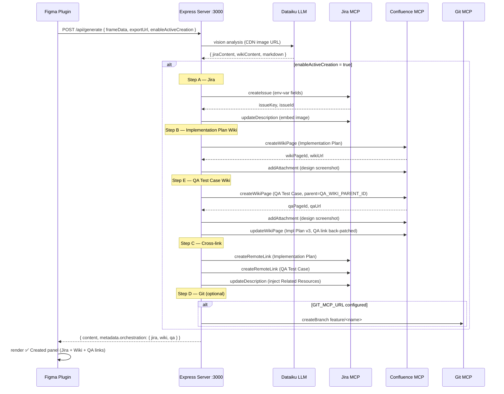
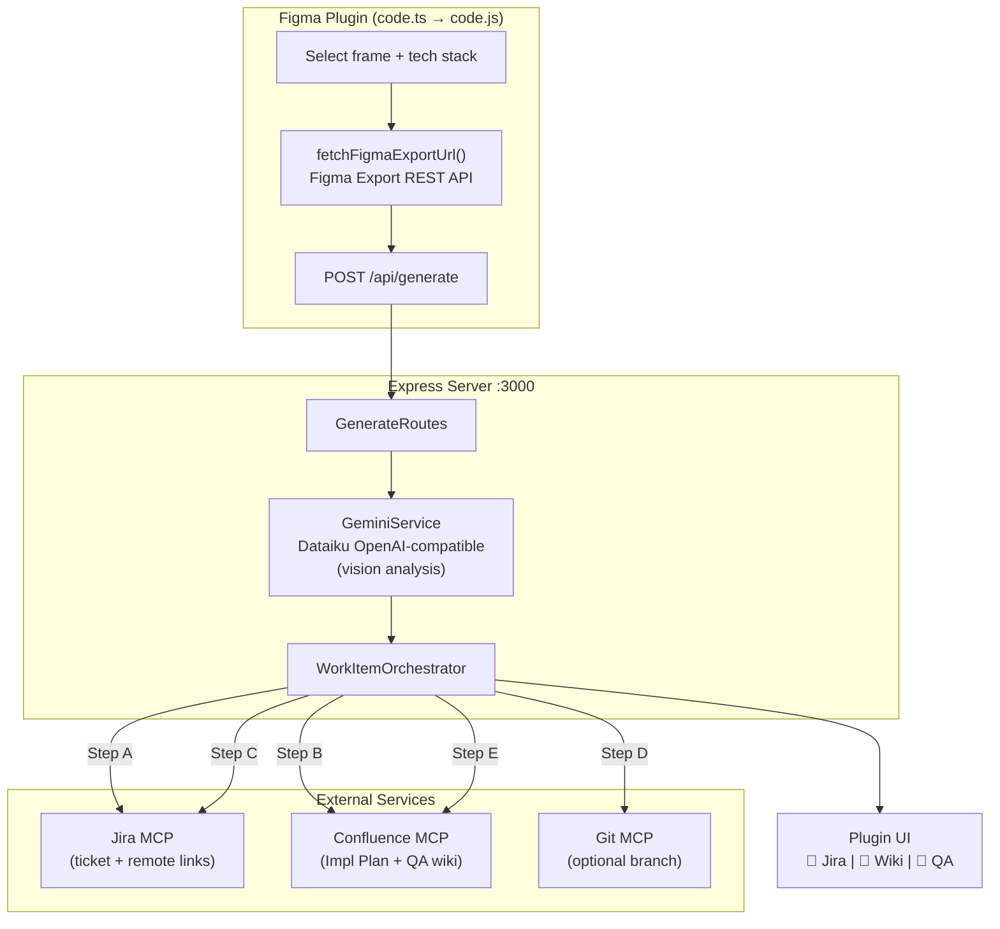

# Architecture

## Overview

The system has two parts: a **Figma plugin** (TypeScript) and a **Node.js server** (Express). The plugin fetches the Figma frame image via the Figma Export REST API (CDN URL) and sends it to the server, which uses a Dataiku OpenAI-compatible model for vision-based analysis and MCP servers to create work items.

---

## Request Flow

```
┌─────────────────────────────────────────┐
│  Figma Plugin  (code.ts → code.js)       │
│                                          │
│  1. User selects frame(s) + tech stack   │
│  2. fetchFigmaExportUrl()                │
│     └─ Figma Export REST API             │
│     └─ returns CDN image URL             │
│  3. buildHierarchy() + extractDesign     │
│     Tokens() → structured frame data     │
│  4. POST /api/generate ──────────────────┼──►
└─────────────────────────────────────────┘   │
                                              │
┌─────────────────────────────────────────────▼──┐
│  Express Server  (app/server.js :3000)          │
│                                                 │
│  GenerateRoutes                                 │
│   └─ normalizeRequest() / validate()            │
│   └─ GeminiService.generate()  ←── PRIMARY      │
│       └─ UnifiedContextBuilder (frame + tokens) │
│       └─ Dataiku OpenAI-compatible model (vision: CDN URL) │
│       └─ returns { content, metadata }          │
│                                                 │
│  [if enableActiveCreation = true]               │
│   └─ WorkItemOrchestrator.run()                 │
│                                                 │
│  Step A ─ Jira                                  │
│       └─ createIssue()  env-var-driven fields   │
│       └─ embed design image in description      │
│                                                 │
│  Step B ─ Confluence  (Implementation Plan)     │
│       └─ createWikiPage() + embed design image  │
│       └─ title: "Implementation Plan: [Frame]"  │
│       └─ header: Figma/Jira/date/resources       │
│       └─ track wikiPageId for later back-patch  │
│                                                 │
│  Step E ─ Confluence  (QA Test Case)            │
│       └─ createWikiPage() under QA_WIKI_PARENT  │
│       └─ title: "[Page] - [KEY] - [Component]" │
│       └─ 8-row test table + screenshot          │
│       └─ back-patches Impl Plan with QA link    │
│                                                 │
│  Step C ─ Cross-link                            │
│       └─ createRemoteLink() ×2  (Impl + QA)    │
│       └─ inject Related Resources h2 in Jira   │
│          (Figma, wiki, Storybook TBD, QA link)  │
│       └─ strip duplicate Design References h2  │
│                                                 │
│  Step D ─ Git  (skipped when GIT_MCP_URL blank) │
│       └─ createBranch() feature/<name>          │
│                                                 │
│  Response: { content, metadata: { orchestration:│
│    { jira: { url, issueKey, status },           │
│      wiki: { url, status },                     │
│      qa:   { url, status } } } }                │
└─────────────────────────────────────────────────┘
                         │
             ┌───────────▼────────────────┐
             │  Plugin UI                 │
             │  ✅ Created panel          │
             │  🎫 View Jira Ticket       │
             │  📄 View Implementation Plan│
             │  🧪 View QA Test Case      │
             └────────────────────────────┘
```

---

## Fallback Path

When the Dataiku LLM is unavailable (missing config, rate limit, error), the server falls back to YAML template generation via `ContextTemplateBridge` -> `UniversalTemplateEngine`. No AI required - pre-baked templates for each platform/tech stack.

```
GenerateRoutes
    └─ GeminiService.generate() -> ERROR
  └─ ContextTemplateBridge.generateDocumentation()
      └─ UniversalTemplateEngine (YAML templates)
      └─ returns template-based content
```

---

## Service Container

All services are registered and initialized at startup via `ServiceContainer.js` (dependency injection). No globals or singletons outside the container.

```
ServiceContainer
  ├─ redis                  ← ioredis client
  ├─ sessionManager         ← session persistence
  ├─ figmaSessionManager    ← Figma API + screenshot
  ├─ configurationService   ← env var wrapper
    ├─ geminiService          ← Dataiku OpenAI-compatible endpoint
  ├─ screenshotService      ← Figma frame export
  ├─ contextManager         ← Figma data extraction
  ├─ mcpAdapter             ← JSON-RPC MCP client
    ├─ ticketGenerationService← thin AI wrapper
  ├─ ticketService          ← alias of above
  └─ workItemOrchestrator   ← Jira + Wiki + Git
```

(11 services, startup ~800ms)

---

## Route Map

| Route file | Endpoints |
|---|---|
| `routes/generate.js` | `POST /api/generate` |
| `routes/health.js` | `GET /`, `GET /health` |
| `routes/figma/core.js` | `GET/POST /api/figma/screenshot`, `GET /api/figma/health` |

---

## MCP Adapter

`MCPAdapter.js` connects to multiple MCP servers simultaneously using JSON-RPC 2.0 over HTTP/SSE. Servers are configured in `config/mcp.config.js`.

```
MCPAdapter
  ├─ jira server        https://mcp-jira.usm-cpr.corp.nandps.com/mcp/
  ├─ confluence server  https://mcp-confluence.usm-cpr.corp.nandps.com/mcp/
  └─ default (git)      http://localhost:3000/api/mcp
```

On startup it attempts to negotiate SSE sessions with each server. MCP calls are made via `callTool(serverName, toolName, params)`. If a server is unreachable, calls degrade gracefully.

### Corporate Confluence MCP quirks

The enterprise Confluence MCP proxy has a restricted parameter schema:

| Tool | Accepted params | Rejected params |
|---|---|---|
| `confluence_create_page` | `space_key`, `title`, `content`, `parent_id` | `content_format`, `version` |
| `confluence_update_page` | `page_id`, `title`, `content` | `content_format`, `version` |

Both default to markdown. The `MCPAdapter` intentionally omits the rejected params.

---

## Mermaid: Full Orchestration Sequence



---

## Mermaid: System Overview



---

## Figma Plugin

`code.ts` compiled to `code.js` via `config/tsconfig.json` (target: ES2017, module: None, outFile: `../code.js`).

Key functions:

| Function | Purpose |
|---|---|
| `handleGenerateAITicket()` | Orchestrates the full plugin flow |
| `fetchFigmaExportUrl()` | Calls Figma Export REST API → returns CDN image URL |
| `buildHierarchy()` | Traverses Figma node tree → structured JSON |
| `extractDesignTokens()` | Extracts colors, fonts, spacing |
| `handleMakeAIRequest()` | POSTs to /api/generate |
| `resolveFileKey()` | Extracts Figma file key from URL |

Plugin → Server communication is a single `POST /api/generate` with frame data, Figma export URL, and user-selected options (tech stack, platform, enableActiveCreation).

---

## Key Files

| File | Lines | Role |
|---|---|---|
| `app/server.js` | ~250 | Express setup, service + route registration |
| `app/routes/generate.js` | ~143 | POST /api/generate handler |
| `core/ai/GeminiService.js` | ~450 | Dataiku OpenAI-compatible integration + vision prompts |
| `core/adapters/MCPAdapter.js` | ~745 | Multi-server MCP client, Jira/Confluence/Git ops |
| `core/orchestration/WorkItemOrchestrator.js` | ~903 | Full Jira + Impl-Wiki + QA-Wiki + back-patch + cross-links + Git flow |
| `core/data/unified-context-builder.js` | ~1,144 | Builds rich context for AI prompt |
| `core/bridge/ContextTemplateBridge.js` | 144 | YAML fallback |
| `core/template/UniversalTemplateEngine.js` | ~876 | YAML template processor |
| `code.ts` | ~440 | Figma plugin source |
| `ui/index.html` | ~550 | Plugin UI (3 creation link buttons) |
